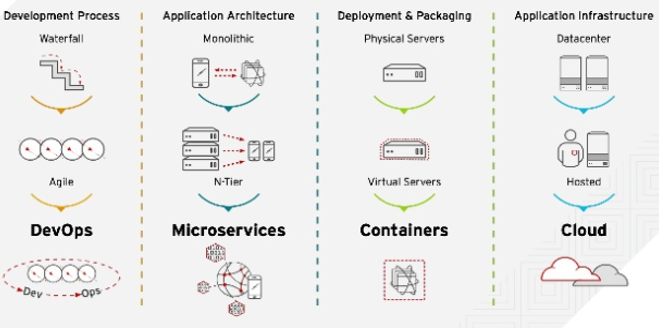
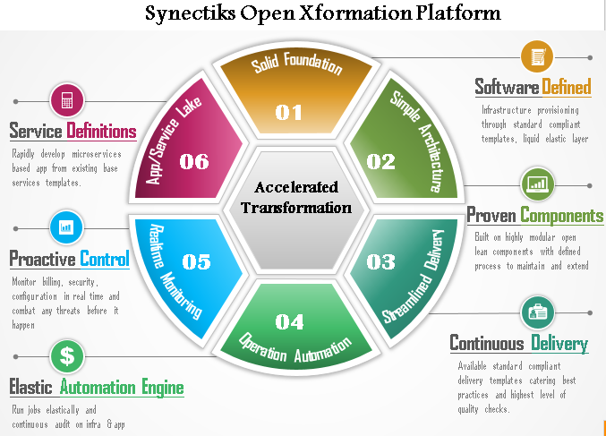
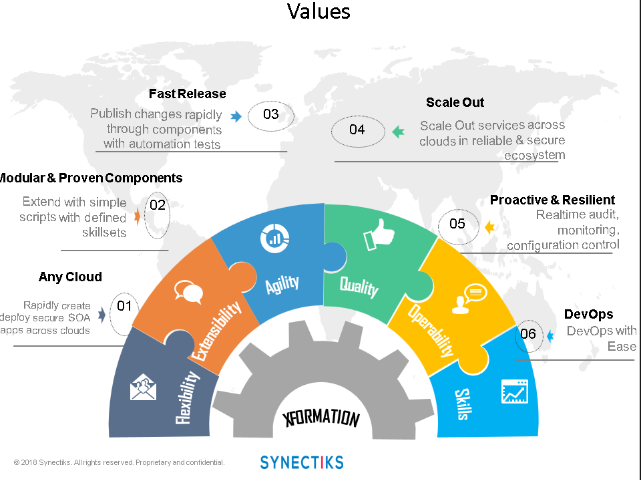
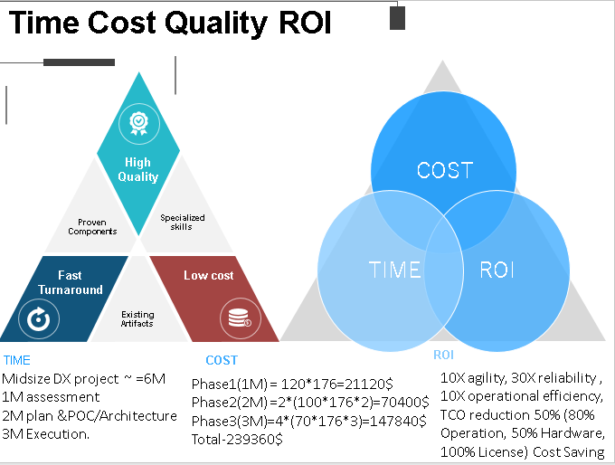

# Introduction

## **Xformation -- Multi cloud container orchestration and continuous delivery platform.**

## Background

As every business today need to address volume / velocity challenges , so the it also must evolve to stay ahead of demand.

Some of the key transformation trends that is happening to cater the demand of volume /velocity is as below:

Xformation platform is accelarating these transformation.

Using xformation platform , customers enjoys the flexibility to go any cloud , create container clusters, develop and deploy micro service / bigdata / IOT applications seamlessly and manage operations with existing automation bots.The xformation platform accelerate Digital Transformation journey, reduce time to do modernization in most defined and secure way.

Synectiks open xformation platform the consolidation of tools / utlities within a simplified and extensible architecture. Customers can use all the existing assets and best practices to perform the transformation in a defined and secure way.

## Inspiration :

I had an oppurtunity to work with a great customer , who had extremely innovative mindset and he had crazy ideas that could help billions of people. But everytime he created some applications with leagcy n-tier architecture, he faced operation challenges while catering volume & velocity and he spent his most time to address them.He was aware that he needed to address the application architecture and do a major replatforming of the existing n-tier architecture. All he was looking for a safe and clear migration path that takes less time and address the scalability and operation chanllenges. I wanted to contribute something for those people who need a platform to do transformation and moderinization in less time in defined way..The xformation platform will help them to create and deliver highly scalable , people friendly applications to mass with less operations and time.

## Rationale :

Today business demand scalability , agility , performance , reliability , security , governance at a low cost. Gone are the days where we could afford to keep thousands of servers , storage , network , many operation support people and many application developer and still facing the scalability and reliability issues. Customers need to achieve more in less. There are few companies like facebook , google , linkedin who has created a biggest success stories , but their entire IT is managed by a few smart programmers. The embraced devops culture , achieved more in less. Why not some of the lessons from their success stories be applied to every it organization.. They have done a marvellous job and they have shared their learnings to the entire world. We felt that we should help customers to effectively adopt those success stories and make effective digital xformation. Synectiks is simplifying the IT. The open xformation platform is an attempt to simplify the complex technologies so that customers can adopt it easily. The xformation platform is delivering best practiced architecture , POC , examples, benchmarking data's so that customers digital xformation journey become smooth. Xformation platform will help organization to embrace the devops culture.Xformation platform have some smart code that creates buckets \(resource pools\) across the cloud and end user can simply keep dropping their application on those buckets. The buckets are elastic and grows up and down with the application load. The regular operations are automated to run everything in autopilot mode. Finally your IT is managed by a few smart programmers and you achieve the business SLA’s in less, you can think of your core business. We bring this cultural transformation in most effective way. We share our experience on world’s largest transformation , we give you the transparency , clarity towards your transformation journey. Together we adopt devops culture , achieve more in less.

## Key Benefits

* Become HARDWARE / OS/ OPERATION/ VENDOR Agnostics
* Achieve  more application scalability / reliability / security / governance
* Create/deploy/ manage better app with less capex & opex

## Values

Following are the key values , the xformation platform aims to deliver:

## Social Impact

* **Time**
  * Instead of spending 90% time in hardware , operation , we can spent that 90% time in innovation , creating better applications that  people can us widely and get benefited. We justify our precious time as well as our due responsibilities towards society.
* **Money**
  * Today business demand to do more in less. Organization will have challenges to deliver more in less CAPEX & OPEX.xformation platform help customers to have elastic infrastructure and application and there reduce any wastage of hardware , people effort. 
* **Environment**
  * The worldwide server consumption is less than 10% , 90% existing hardware is underutilized. We can  create a software defined world and reclaim existing hardware resources. Hardware  creates carbon, need power. If we reclaim properly the worldwide idle hardware resources even 20% , then world wont need hardware for next 10 years. That can sponsor billions of people education.

## Key Technologies

* We are working primarily on IAAC\( infrastructure as a code\) , container orchestration , server less programming , cloud automation and RAD\( rapid application development technologies\).

## ROI & TCO

* TCO reduced to 50%, because of 80% operation cost , 50% Hardware Cost , 100% License cost saving.

The detail ROI analysis as follows:

