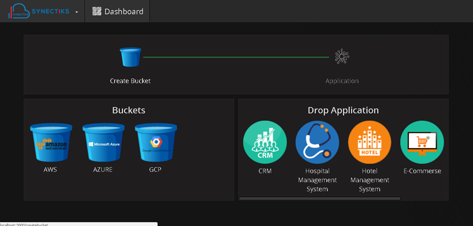
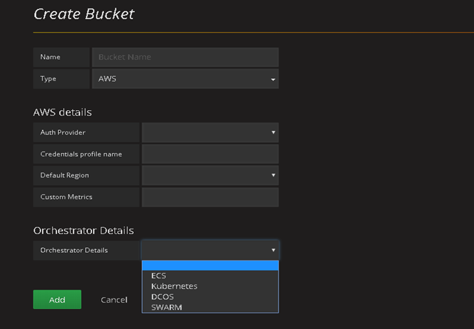
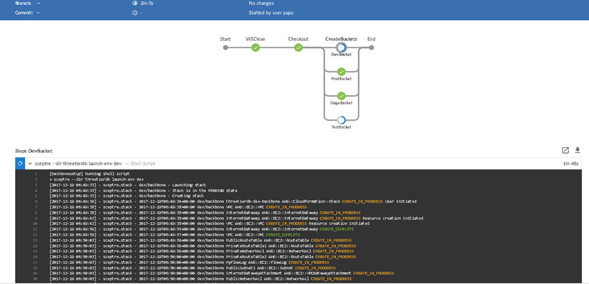
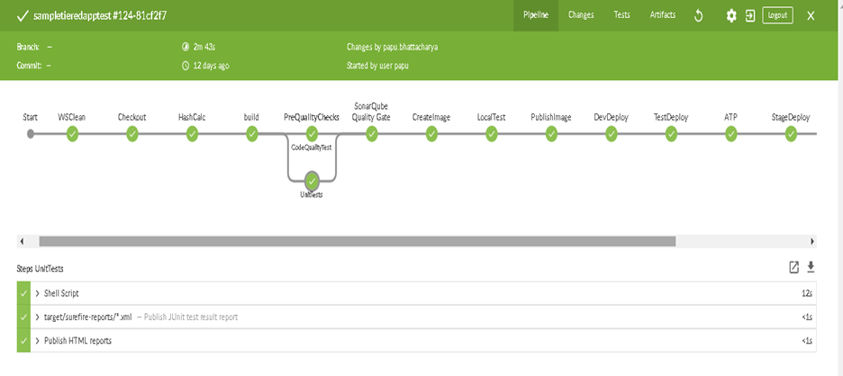
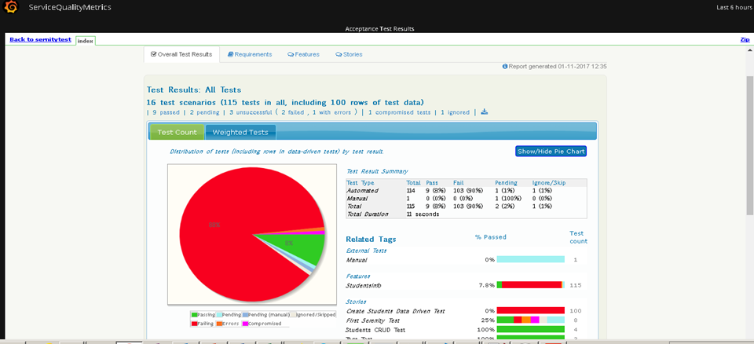
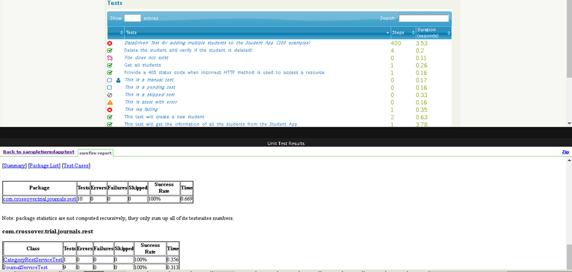
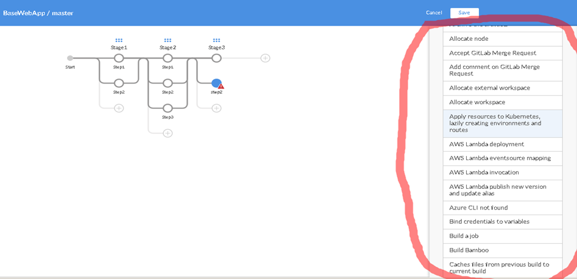
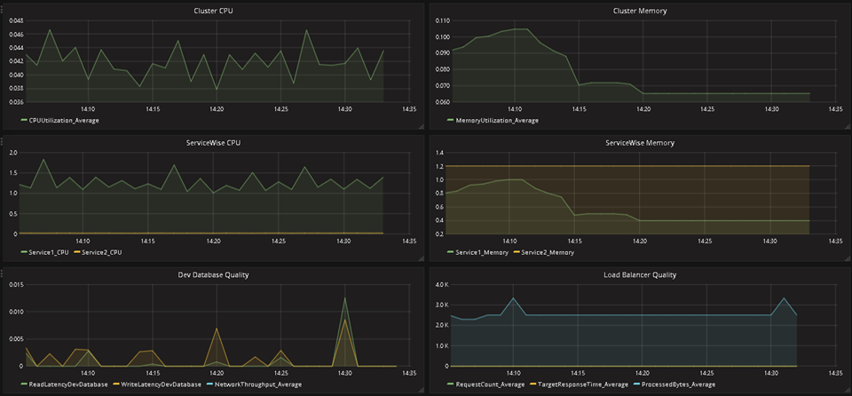
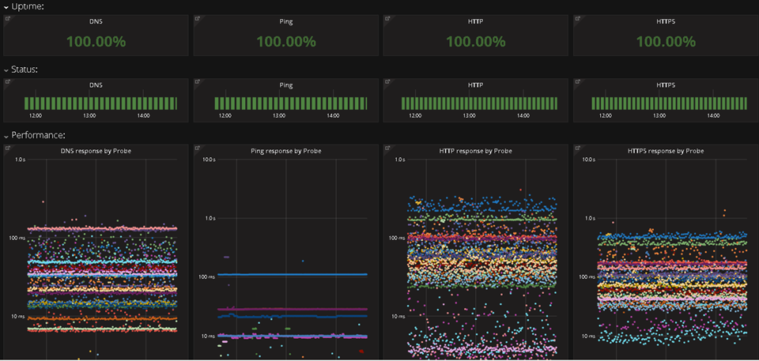

# User Interfaces

## Home Screen

## Aggregate Resources from MultiCloud

## Infrastructure As A Code for Bucket Creation

## 

## Continous Microservices Delivery Platform

## Service Quality Metrics

## Automation Central

## Operation Central -- Service wise & Total resource consumption

## Operation Central -- Availability Central

